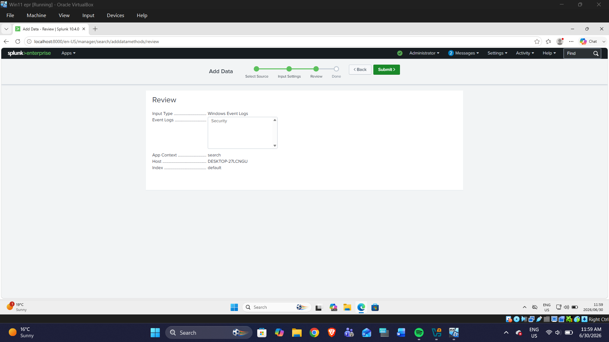
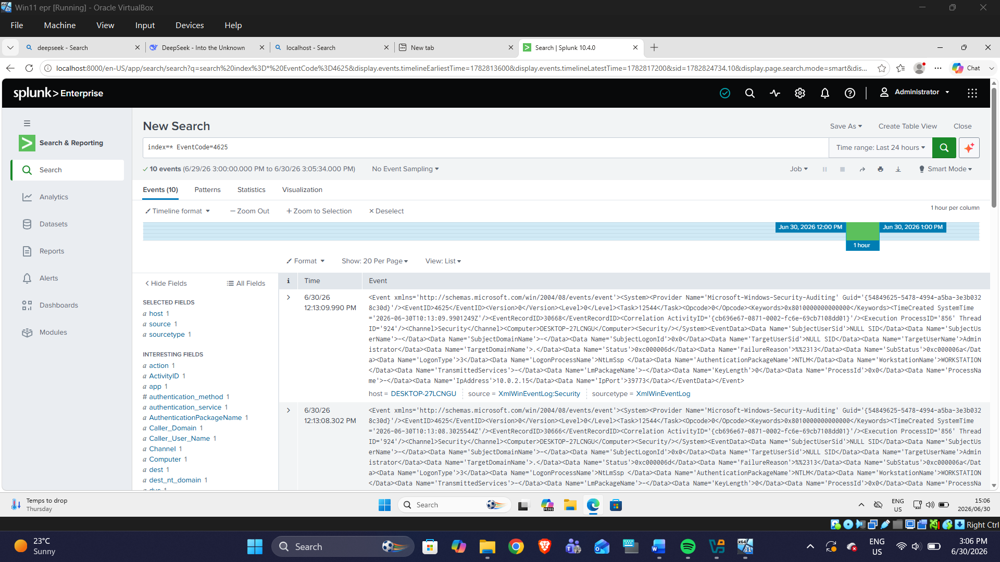
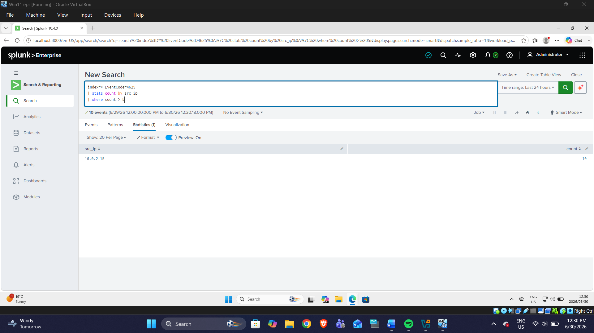
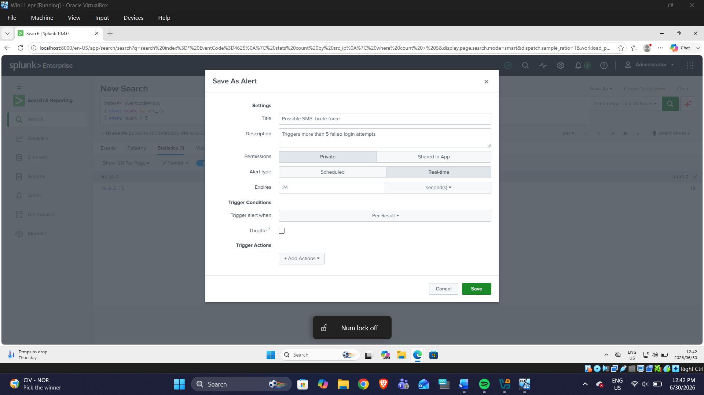

# Splunk Security Monitoring Lab Report

## Detection of Repeated Failed Login Attempts

### Overview
This project demonstrates how Splunk Enterprise can be used to monitor Windows security logs and detect suspicious login activity.

### Screenshots

#### 1. Splunk Data Input Review

#### 2. Failed Login Event Search

#### 3. Metasploit SMB Login Setup

#### 4. Metasploit Brute Force Results

#### 5. Splunk Detection Results

#### 6. Splunk Alert Creation

Splunk Security Monitoring Lab Report

Detection of Repeated Failed Login Attempts

30/06/2026

Author: Dhlalambi Clive

Overview

This project demonstrates how Splunk Enterprise can be used to monitor Windows security logs and detect suspicious login activity. The lab focused on identifying multiple failed login attempts, which may indicate a possible brute-force attack.

Objective

The objective of this project was to:

•	Collect Windows Security Event Logs in Splunk

•	Simulate repeated failed login attempts in a lab environment

•	Detect failed logon events using Splunk

•	Create an alert for suspicious authentication activity

Tools Used

•	Splunk Enterprise
•	Windows 11
•	Kali Linux
•	Metasploit Framework

Lab Setup

The environment consisted of:
•	A Windows 11 virtual machine running Splunk Enterprise

•	A Kali Linux virtual machine used to simulate failed login attempts

•	Windows Security Event Logs configured as the log source in Splunk

Process

1.	Windows Security logs were added to Splunk for monitoring.
2.	A series of failed login attempts were generated from the Kali Linux machine against the Windows host.
3.	Splunk was used to search for Event ID 4625, which represents failed logon attempts.
4.	A query was created to identify source IP addresses with more than five failed login attempts.
5.	An alert was configured in Splunk to flag this behavior automatically.

Detection Query

spl:

index=* EventCode=4625
| stats count by src_ip
| where count > 5

Result

The search identified one source IP address responsible for repeated failed login attempts:

•	Source IP: 10.0.2.15
•	Failed Attempts: 10

This confirmed that the simulated activity was successfully captured and detected in Splunk.
Alert Created
An alert titled “Possible SMB brute force” was created to trigger when failed login attempts from a single source exceed the defined threshold.

Conclusion:

This lab demonstrates a simple and effective approach to detecting suspicious login activity using Splunk and Windows Security logs. It highlights the value of log monitoring and alerting in identifying early signs of brute-force behavior in a controlled security environment.

Skills Demonstrated:

•	Log collection and monitoring
•	Windows event analysis
•	Splunk search and detection
•	Alert creation
•	Basic security threat simulation

Note!
This project was conducted in a controlled lab environment for educational and defensive security purposes only.
